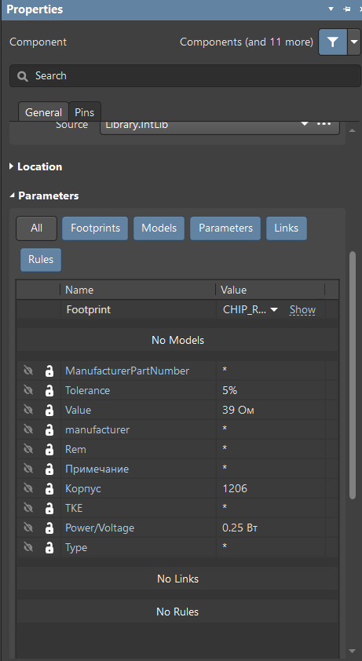
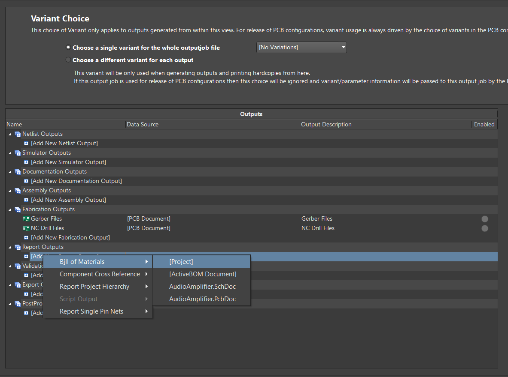
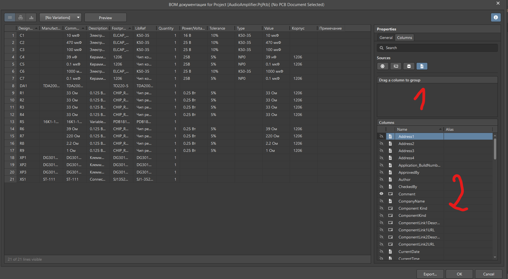
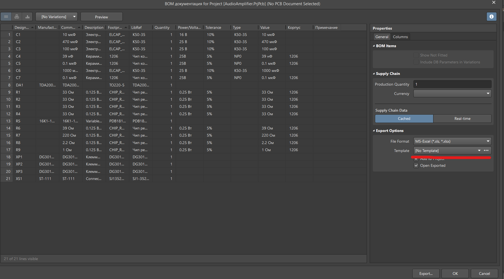
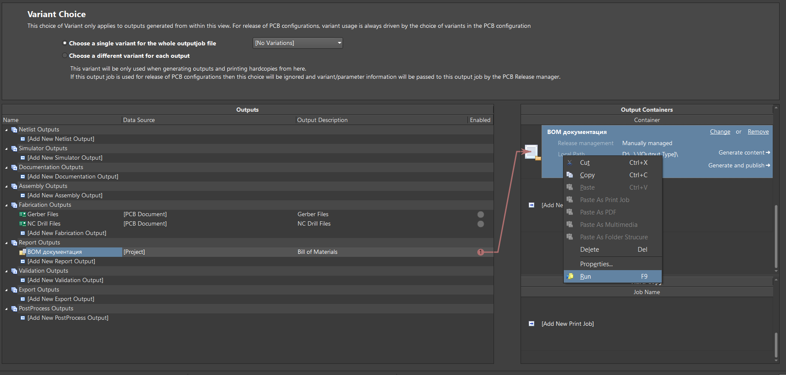

# Шаблон для генерации спецификации и перечня элементов к проектам печатных плат в соотвествии с ЕСКД

## Содержание

1. [Описание параметров компонентов;](#parameter-description)
2. [Описание параметров схемы;](#sch-parameters)
3. [Настройка Altium Designer;](#altium-settings)
4. [Использование шаблона.](#using)

## 1. Описание параметров компонентов

Представленные ниже параметры используются для заполнения данных о компонентах в спецификации и перечне элементов (параметры добавляются в УГО каждого компонента).

| Параметр | Описание |
| ------ | ------ |
| Designator | Позиционное обозначение элемента |
| Rem | Наименование позиции, если компонент не относится к группе "Прочие изделия" (группа компонента определяется параметром [GroupSpecification](#groupspecification) ) | 
| Корпус | Тип корпуса компонента | 
| Value | Значение (величина емкости для конденсаторов, величина сопротивления для резисторов) | 
| Tolerance | Точность значения компонента в процентах |
| Power/Voltage | Мощность для резисторов и напряжение для конденсторов |
| Type | Тип компонента (тип диэлектрика для керамических конденсаторов, исполнение элемента и т.п) |
| ManufacturerPartNumber | Наименование компонента от производителя |
| Manufacturer | Наименование фирмы-производителя |
| Quantity | Количество компонентов |
| Примечание | Описание особенностей монтажа или самого компонента |
|  GroupSpecification | Группа компонента в спецификации: 
1 - Сборочные единицы;

2 - Детали;

3 - Стандартные изделия;

4 - Прочие изделия (По умолчанию)
 |
| DocNumber | Децимальный номер документа для параметра [GroupSpecification](#groupspecification) равному 1, 2 и 3 |

## 2. Описание параметров схемы

| Параметр | Описание |
| ------ | ------ |
| Author | Автор |
| CheckedBy | Проверил | 
| N_kontr | Н. контроль | 
| ApprovedBy | Утвердил | 
| lit_A | Литера | 
| DecimalNumber | Децимальный номер | 
| Name1 | Наименование (верхняя строка) | 
| Name2 | Наименование (нижняя строка) | 
| CompanyName | Наименование компании | 
| PcbNumber | Номер документа печатной платы (если необходимо добавить печатную плату в спецификацию) | 
| PcbType  | Группа печатной платы в спецификации (1 - сборочная единица, 2 - деталь) | 

## 3. Настройка Altium Designer
Заполнение данных об элементах происходит на основе параметров УГО каждого компонента принципиальной схемы, имена параметров должны соотвествовать разделу [описание параметров](#parameter-description)

Пример:

Далее необходимо создать outputjob файл и добавить к проекту, после этого добавить элемент в группу Report Outputs, тип элемента Bill of materials:

Далее нужно сделать двойной щелчок мыши на добавленный элемент Report Outputs и включить параметры из раздела [описание параметров](#parameter-description) в поле, отмеченном цифрой 2 на фотографии:

Поле отмеченное цифрой 1 на фотографии должно быть пустым.

Теперь необходимо указать шаблон для генерации в отмеченном карсным цветом поле:

## 4. Использование шаблона

В открытом файле outpujob необходимо использовать готову Folder structure либо создать новую в разделе Output Containers и затем нажать кнопку Run

